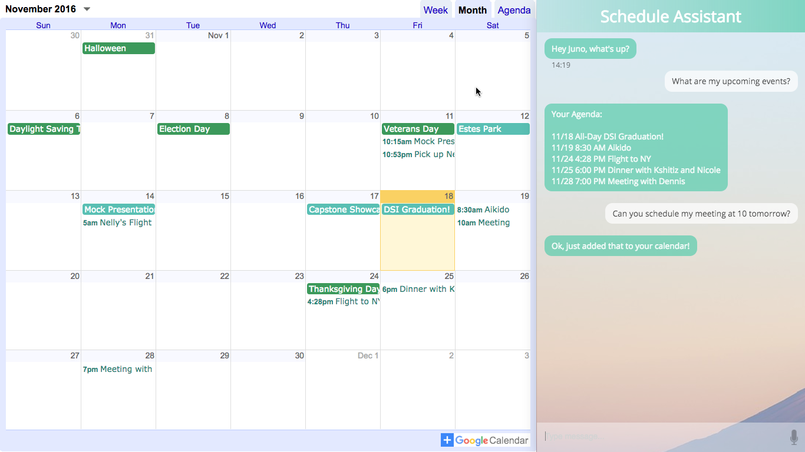

# Scheduling Assistant
A personal assistant that helps you manage your schedule and understands the way you would speak to a human. It can create events on your Google Calendar for you and answer questions you have about your schedule, such as "What are my events for the next few days?" You can view presentation slides for this project [here.](http://slides.com/junolee/scheduling-assistant)

